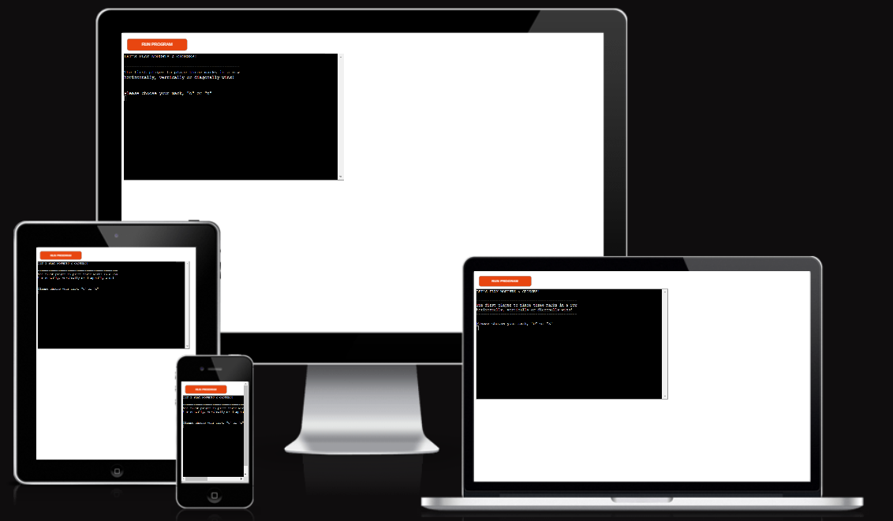
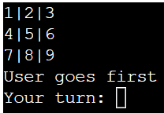
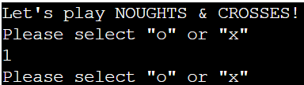
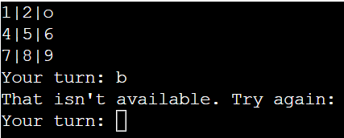
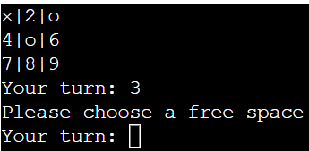
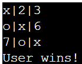
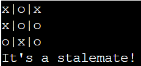

# Noughts and Crosses

[View the live project here](https://noughts-and-crosses-rm.herokuapp.com/)

NOUGHTS & CROSSES is a Python terminal-based version of the classic paper and pencil game also known as "Tic-tac-toe".

Users can try to beat the computer by placing 3 of their marks (x's or o's) in a row.

# How to play

NOUGHTS & CROSSES is a classic strategy game that can trace its roots back to the Romans or even ancient Egyptians!  [See Wikipedia for more info](https://en.wikipedia.org/wiki/Tic-tac-toe).

There are 8 possible ways to win by placing 3 of your chosen marks in a row horizontally, vertically or diagonally.

A stalemate will be declared if all of the spaces are populated without either player placing 3 in a row.

In this version the player inputs ther choice of mar (x or o) and the initial board is drawn.

Rather than presenting empty spaces and using coordinates, the available spaces on the board are presented as numbers 1 - 9, arranged as they would be on a keypad.

The game alternates between the user and computer, whose marks are entered onto the board in place of the initial grid numbers.

The winner is the player that places 3 of their marks in a row.

# Features

+ ## Existing Features

    + Creation of a 3 x 3 game board

        + Pre-populated with placeholder numbers

        + Placeholders replaced each turn by user/computer's designated marks

            
    
    + User is able to select their mark, x or o, via an input command

        + input validation limited to x or o

            

    + Automatic designation of computer's mark based on user's input

    + Play against the computer

    + First turn randomised between user and computer

    + Alternate turns between user and computer by incrementing the turn variable

    + If user's turn, accept input 

        + input validation 

            
        
        + Only able to select from the list of available spaces (indicated by the numbers on the board)

            

        + The chosen number is replaced on the board with the user's mark (x or o)
    
    + If computer's turn

        + Randomised selection 
        
        + Only able to select from list of available spaces (indicated by the numbers on the board)

        + Selected number replaced on board by the computer's mark (x or o)
    
    + Determine whether there is a winner

        + check for three marks in a row horizontally, vertically or diagonally

            

    + Declare a stalemate (draw) if all of the spaces are used up and neither user or computer has 3 marks in a row

        

+ ## Future Features

    + Add a play again function to reset the board.

    + Add the option for two-player mode rather than user vs computer.

    + Apply some logic to make the computer more competitive.

# Testing

I have manually tested this project in the following ways: 

+ The program passed through [pythonchecker.com](https://www.pythonchecker.com/) without any hints.

+ Tested the input validation:

    + User's mark of choice - entered characters not in list, numbers, special characters, uppercase characters

    + User's space on the board - entered characters not in list, numbers, special characters, uppercase characters 

+ Tested in the local terminal and the deployed Heroku app.

+ I have tested the [README.md](https://github.com/Rob-Mundy/Noughts_and_Crosses#readme) file with the [MD Reader](https://chrome.google.com/webstore/detail/md-reader/medapdbncneneejhbgcjceippjlfkmkg) extension for Chrome.

# Validator Testing

+ [pythonchecker.com](https://www.pythonchecker.com/)

    + No hints returned from pythonchecker.com

+ Passed code through [codebeautify.com](https://codebeautify.org/python-formatter-beautifier) python formatter.

# Bugs

+ I noticed that the computer's turn was returning the same sequence of numbers despite it being generated via a random function. I found an article on [stackoverflow.com](https://stackoverflow.com/questions/47937813/random-choice-not-acting-random-at-all) that mentioned that lists are only evaluated once, so it was necessary to shuffle the list of available spaces (random.shuffle) before the computer's turn in order to get a truly random outcome.

+ I reached the terminal row limit when testing my initial Heroku deployment which meant the game could not be completed. This was resolved by clearing the terminal each round instead of prining multiple versions of the board.  See function replace_terminal() for details.

+ The computer's turn was printed to the terminal far too quickly for the user to read, so I found a set of libraries and a function that mimics typing so that the information can be properly digested each turn.  See function simulate_typing() for details.

+ There are no outstanding bugs

# Deployment

## Heroku 

This project was deployed to Heroku via the following process:

+ From the homepage click "New" then "Create new app"

+ Give the project an appropriate name, select "Europe" as the region then click "Create app"

+ In the "Settings" tab, click "Add buildpack" and separately add "node.js" and "python"

+ In the "Deployment" tab, select "GitHub - Connect to GitHub" as the Deployment method

+ Search for the GitHub project name, "noughts_and_crosses", in the "Search for a repository to connect to" search box

+ Click "Connect" button at the bottom of the page

+ When connected, scroll to the bottom of the page and in the "Manual deploy" section, select "main" as the chosen branch to deploy and click "Deploy Branch"

+ Following a short build process a link to the project becomes available

+ Click "View" to [open the project in a new window](https://noughts-and-crosses-rm.herokuapp.com/)

# Credits

## Content

+ replace_terminal() - The idea for clearing/replacing the terminal was sourced from [stackoverflow.com](https://stackoverflow.com/questions/2084508/clear-terminal-in-python).

+ simulate_typing() - The code to simulate typing while printing was also sourced from [stackoverflow.com](https://stackoverflow.com/questions/58763136/printing-every-thing-slowly-simulate-typing)